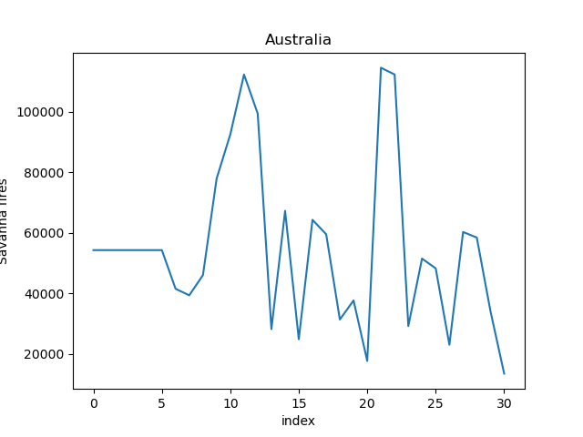
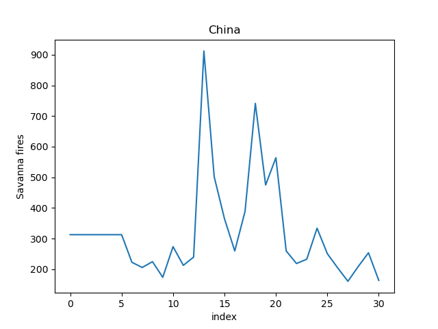
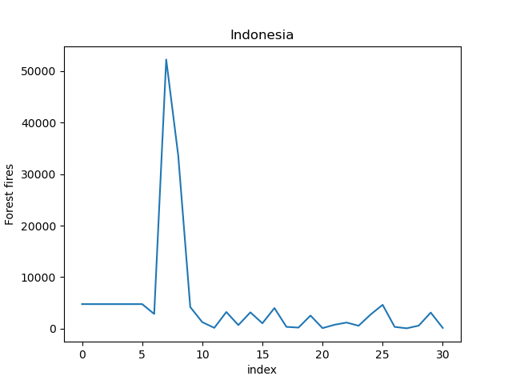
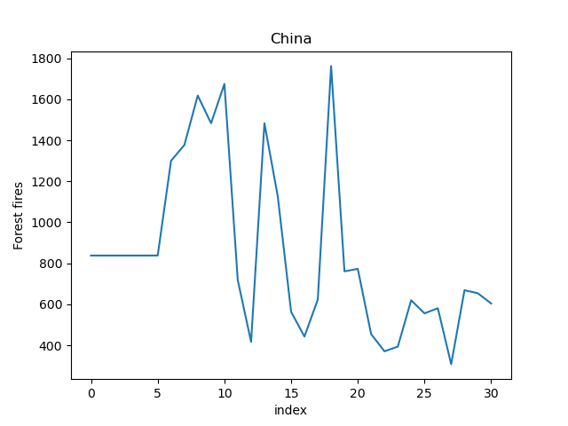

[](https://classroom.github.com/a/oQi7O4AA)
[](https://github.com/cu-swe4s-fall-2023/assignment-2-python-refresher-eli-miller/actions/workflows/unit_test.yml)

_Functionality to read in the AGRO Food dataset and extract information_

# Analysis of CO<sub>2</sub> Emissions from Fires
## Introduction

Previous analysis shows that some major CO<sub>2</sub> emission sources are from fires. Further, three different
countries are the leader in three major catagoreys of emission: Savanna Fires, Forest Fires, and rice cultivation.
This analysis aims to understand the causes of these maximum values and if they are due to outliers in the data or
overall trends of emission by countries.

 Emission Catagory | Country   | CO<sub>2</sub> Emissions (unkn) 
-------------------|-----------|---------------------------------
 Savanna Fires     | Australia | 114616.4011                     
 Forest Fires      | Indonesia | 52227.6306                      
 Rice Cultivation  | China     | 164915.2556                     

## Methods

The dataset used for this analysis is the AGRO Food dataset. For each country and emission catagorey listed above,
we produce a plot of the CO<sub>2</sub> emissions over time. Plots are then analyszed to understand if the maximum
values are due to outliers or overall trends.

## Results

### Savanna Fires




We see that the maximum value for Australia may be due to an outlier in the data, however the savanna fires in China
are much lower overall. This is likely due to the large amount of land in Australia that is savanna compared to China.

### Forest Fires




We see that the maximum value for Indonesia is clearly due to an outlier in the data. Additionally, the overall
emissions in Indonesia are much higher than China. This is likely due to the large amount of land in Indonesia that
is forest compared to China.

### Rice Cultivation


Unlike the other two categories, the maximum emissions from rice cultivation are due to an overall inceasing trend
in the data. This pattern is seen in all countries. This highlights the difference in the causes of CO<sub>2</sub>
from sporadic events, such as fires, and continuous events, such as rice cultivation.

## Installation Instructions

1. Clone the repository

```git clone https://github.com/cu-swe4s-fall-2023/assignment-2-python-refresher-eli-miller```

2. Get the `Agrofood_co2_emissions.csv` from Google Drive and place it in the `src/` directory
3. Navigate into the source directory

```cd src```

4. Run the script using the bash file

```run.sh```

## Usage

`print_fires` takes a target country and column number and returns integer rounded values of the annual
CO<sub>2</sub> emissions from fires in that country.

Command line arguments:

* `--country_column`  - The column number of the country column
* `--country` - The country to query
* `--result_column` - The column ~~number~~ name (starting in v5.0) of the column to return values from
* `--file_name` - The path to the dataset file.
    * This script will run from /src/ so ensure to use relative paths to get to the dataset.
* `--verbose` (optional) - Print out what the function is doing to the user

Examples:

```bash
python print_fires.py --country "United States of America" --country_column 0 --result_column 3
```

## Helper Functions

`get_country_names` returns a list of all country names in the dataset. Helpful for debugging.

`get_col_names` returns a list of the column names in the dataset. The position of the column name in the list is
the input parameter for `get_column`.

# Testing

tests should be run from the appropriate test directory. For example:

change directory to run unit tests

```cd tests/unit```

Then run the test file

```python test_my_utils.py```


